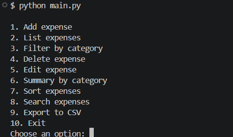
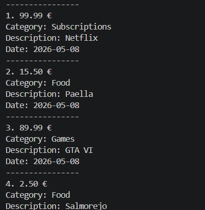
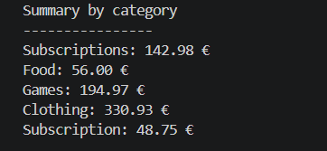
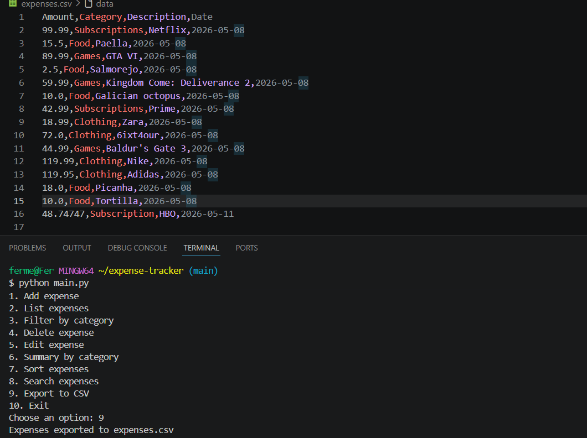

# Expense Tracker

A simple command-line expense tracker built with Python.

This project allows users to manage expenses directly from the terminal using a menu-based interface. Expenses are stored in JSON format and can also be exported to CSV.

---

## Features

- Add expenses
- List all expenses
- Filter expenses by category
- Edit existing expenses
- Delete expenses
- Search expenses by text
- Sort expenses by amount or date
- View expense summaries by category
- Export expenses to CSV
- Persistent storage using JSON

---

## Technologies Used

- Python
- JSON
- CSV
- File handling
- Modular programming

---

## How to Run

Clone the repository:

```bash
git clone https://github.com/ferggz/expense-tracker.git
```

Go to the project folder:

```bash
cd expense-tracker
```

Run the program:

```bash
python main.py
```

---

## Example Data

Example expenses are included in:

- `expenses.json`
- `expenses.csv`

---

## What I Learned

Through this project I practiced and improved my understanding of:

- Python functions and modular code structure
- CRUD operations (Create, Read, Update, Delete)
- Working with lists and dictionaries
- Reading and writing JSON files
- Exporting data to CSV files
- Input validation and error handling
- Searching, filtering and sorting data
- Organizing larger Python projects across multiple files
- Writing cleaner and more reusable code

This project also helped me become more comfortable building complete terminal-based applications with persistent data storage.

---

## Future Improvements

Possible future improvements include:

- SQLite database integration
- Flask web version
- User authentication
- Monthly reports
- Charts and statistics
- Budget tracking

---

## Screenshots

### Main Menu



---

### Expense List



---

### Category Summary



---

### CSV Export

